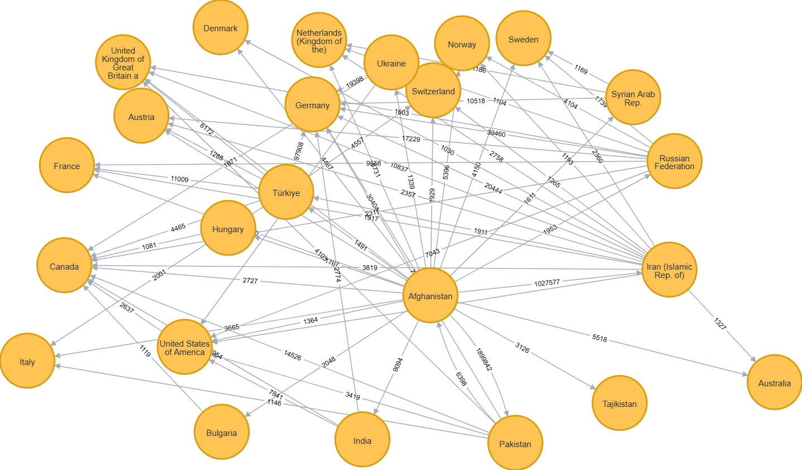
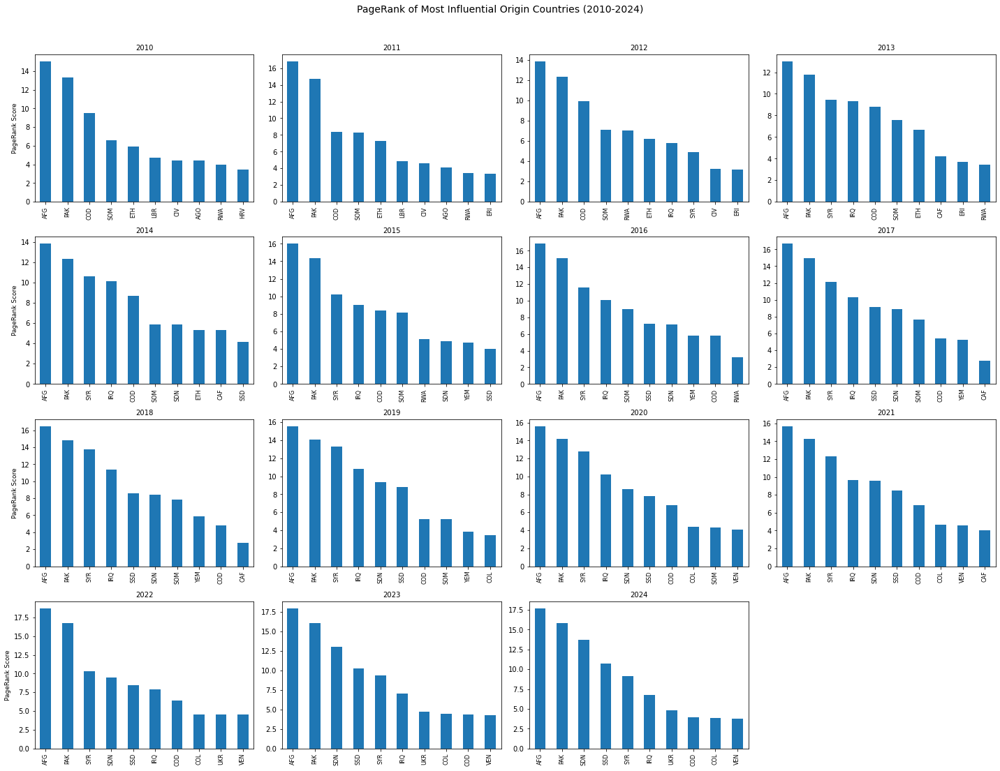
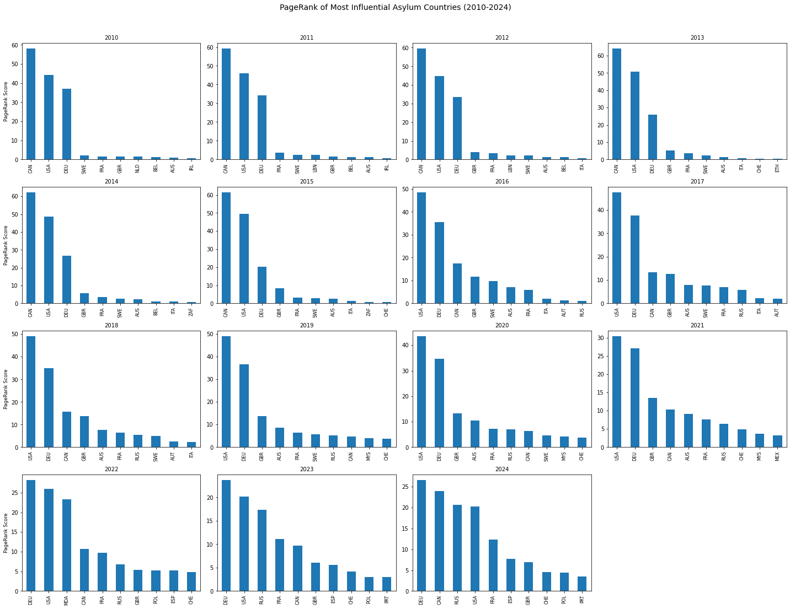
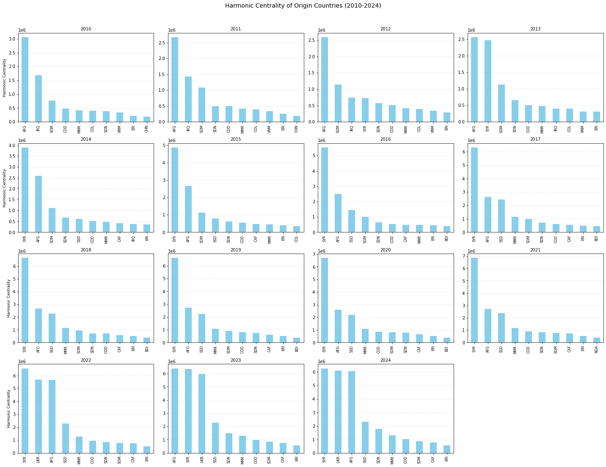
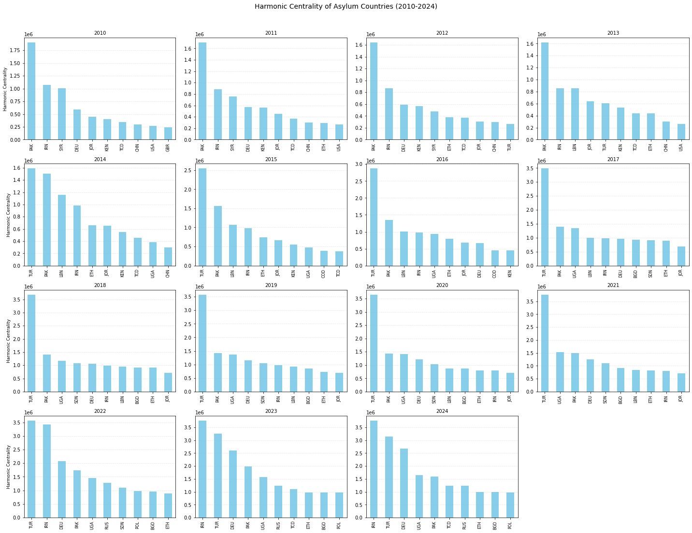
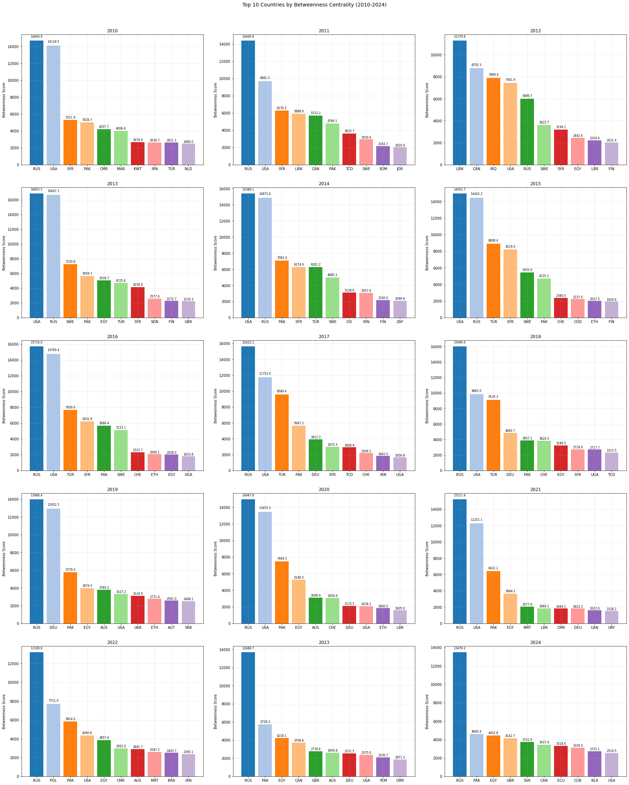
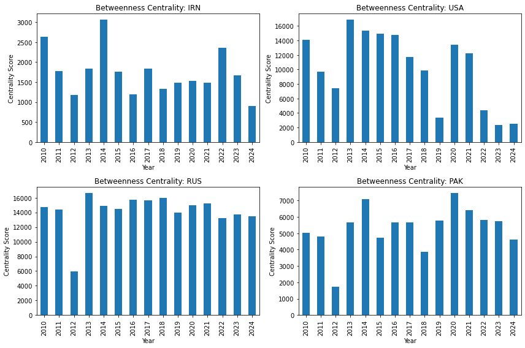
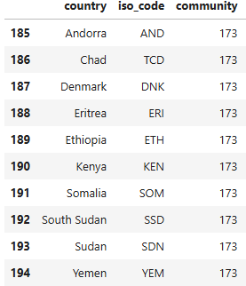

# Refugee Data Analysis with Neo4j

*Final project for my data engineering class*

## Overview
**Goals:** Model refugee migration as a weighted graph, apply centrality/clustering algorithms to uncover structural insights, and analyze how crises reshape migration networks.



Each node corresponds to a country. We model refugee flow as a directed relationship between countries weighted by number of refugees.

The above picture is an example query for every country Afghanistan sent at least 1000 refugees to in 2010. 
## Data Sources
The refugee data are downloaded directly from the [TidyTuesday GitHub repo](https://github.com/rfordatascience/tidytuesday/tree/main/data/2023/2023-08-22), originally provided by:

- UNHCR (United Nations Refugee Agency)
- UNRWA (United Nations Relief and Works Agency for Palestine Refugees)
- IDMC (Internal Displacement Monitoring Centre)

The data encompass refugee migration patterns from 2010 - 2024.

## Technologies Used
- **Neo4j:** For modeling refugee flows and running graph algorithms.
- **Jupyter Notebooks:** For data cleaning, analysis, and visualizing results.
- **Other:** numpy, pandas, matplotlib, seaborn 

## Results

Here are a few of the results for running various graph algorithms. For more analysis, see the notebook ```code/data_science_graph_algos.ipynb```

1. **PageRank:** Identified influential origin and asylum countries using country neighborhoods.



2. **Harmonic Centrality:** Identify influential origin and asylum using a distance-based centrality measure.



3. **Betweenness Centrality:** Highlight countries that act as intermediaries for refugee flow.



4. **Louvain Modularity:** Identify geographic clusters of refugee movement (wasn't too insightful though).


